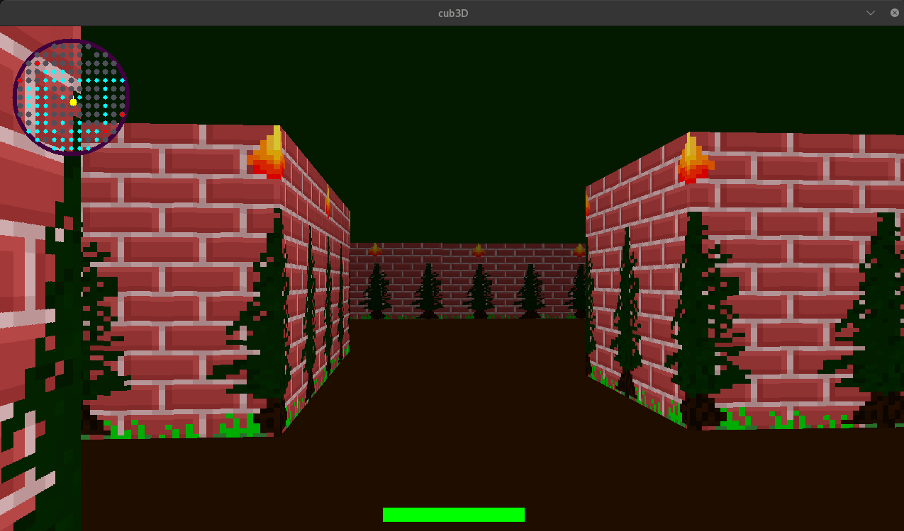
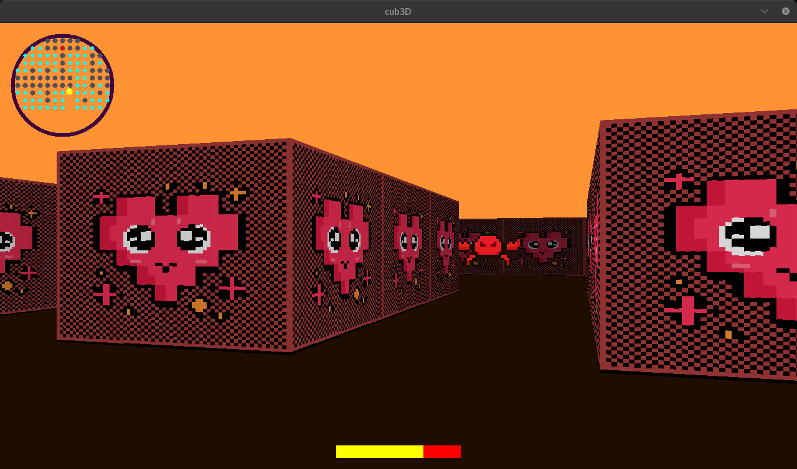
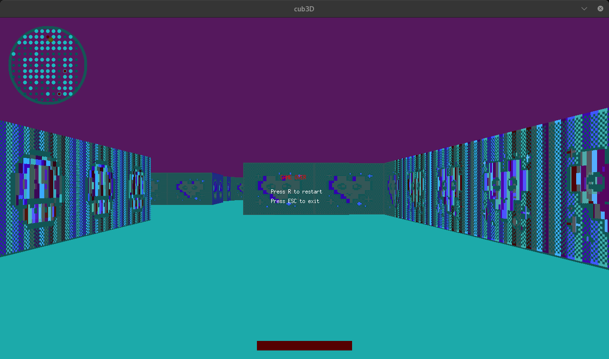
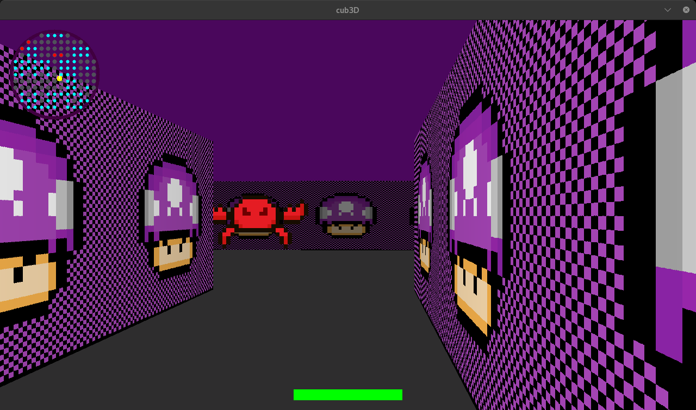

# 🎮 cub3D - 3D Raycasting Game Engine

<div align="center">


*A first-person 3D maze game built from scratch using raycasting principles*

[Features](#-features) • [Installation](#-installation) • [Usage](#-usage) • [Controls](#-controls) • [Map Format](#-map-format) • [Technical Details](#-technical-details)

</div>

---

## 📋 Table of Contents

- [Overview](#-overview)
- [Features](#-features)
- [Technical Implementation](#-technical-implementation)
- [Installation](#-installation)
- [Usage](#-usage)
- [Controls](#-controls)
- [Map Format](#-map-format)
- [Project Structure](#-project-structure)
- [Screenshots](#-screenshots)
- [Performance](#-performance)
- [Credits](#-credits)

---

## 🎯 Overview

**cub3D** is a 3D raycasting game engine inspired by the legendary Wolfenstein 3D. This project implements a complete 3D rendering system from scratch using only basic 2D graphics primitives, demonstrating the mathematical principles behind early 3D games.

Built as part of the 42 Network curriculum, this project goes beyond the mandatory requirements by implementing advanced features like enemy AI, health systems, and enhanced graphics effects.

### 🏆 Project Achievements
- ✅ **100% Mandatory Requirements** - All core features implemented
- 🌟 **All Bonus Features** - Minimap, wall collisions, mouse controls, animated sprites
- 🚀 **Advanced Features** - Enemy AI system, player health, game states, visual effects
- 💀 **Combat System** - Health bar, damage mechanics, enemy attacks, and death conditions

---

## ✨ Features

### 🎮 Core Gameplay
- **First-Person 3D View** - Smooth raycasting-based 3D rendering
- **Textured Walls** - Different textures for North, South, East, and West walls
- **Smooth Movement** - WASD movement with collision detection
- **Mouse Look** - 360° mouse-controlled camera rotation
- **Immersive Experience** - Realistic 3D perspective with proper depth

### 🗺️ Navigation & Interface
- **Interactive Minimap** - Real-time circular minimap with player position
- **Wall Collision System** - Prevents walking through walls
- **Smooth Controls** - Responsive keyboard and mouse input
- **Clean UI** - Minimalist interface focusing on gameplay

### 👾 Advanced Systems
- **Enemy AI** - Intelligent enemy behavior with detection, following, and attack patterns
- **Health System** - Dynamic health bar that decreases when enemies attack the player
- **Damage Mechanics** - Real-time damage detection with visual feedback and cooldown system
- **Death System** - Player can die when health reaches zero, triggering game over state
- **Visual Effects** - Screen overlays, damage effects, red screen flash on damage
- **Game States** - Complete win/lose conditions with proper game flow management

### 🎨 Graphics & Audio
- **64x64 Textures** - High-quality wall and sprite textures
- **1280x720 Resolution** - Sharp, clear visuals
- **Animated Sprites** - Multiple enemy types with different appearances
- **Color Customization** - Configurable floor and ceiling colors

---

## 🔧 Technical Implementation

### Raycasting Engine
```c
// Core raycasting algorithm
void raycast(t_game_state *game)
{
    // Cast rays for each screen column
    for (int x = 0; x < SCREEN_WIDTH; x++) {
        // Calculate ray direction
        calc_ray_pos_dir(&game->data->var, x, &ray_dir_x, &ray_dir_y);
        
        // Perform DDA algorithm
        set_dda_params(&dda, &game->data->var, ray_dir_x, ray_dir_y);
        perform_dda(&dda, game->data->map);
        
        // Calculate wall height and draw
        calc_wall_params(&dda, &game->data->var, ray_dir, &render);
        draw_textured_line(game->img, x, &render, game->data);
    }
}
```

### Memory Management
- **Efficient Resource Handling** - Proper allocation and deallocation
- **Texture Caching** - Pre-loaded textures for optimal performance
- **Clean Exit** - Graceful shutdown with complete memory cleanup

### Health & Combat System
```c
// Player health management with damage cooldown
typedef struct s_player_stats {
    int health;
    int max_health;
    int damage_cooldown;
    int is_damaged;
} t_player_stats;

// Health bar rendering with dynamic width based on current health
void draw_health_bar(t_game_state *game) {
    t_health_bar bar;
    bar.fill_width = (game->player.health * bar.width) / game->player.max_health;
    // Render health bar with visual damage feedback
}
```

### Architecture
- **Modular Design** - Separated concerns across multiple modules
- **Clean Code** - Well-documented, maintainable codebase
- **Error Handling** - Comprehensive error checking and reporting

---

## 🚀 Installation

### Prerequisites
- **GCC Compiler** - With support for C99 standard
- **Make** - Build automation tool
- **X11 Development Libraries** - For graphics support
  ```bash
  # Ubuntu/Debian
  sudo apt-get install gcc make xorg libxext-dev libbsd-dev
  
  # Arch Linux
  sudo pacman -S gcc make xorg-server libxext libbsd
  ```

### Build Instructions
1. **Clone the repository**
   ```bash
   git clone https://github.com/abouguri/cub3d.git
   cd cub3d
   ```

2. **Compile the project**
   ```bash
   make
   # or for bonus features (already included)
   make bonus
   ```

3. **Clean build files (optional)**
   ```bash
   make clean    # Remove object files
   make fclean   # Remove all generated files
   make re       # Rebuild everything
   ```

---

## 🎮 Usage

### Basic Usage
```bash
./cub3d maps/BRICKS0.cub
```

### Available Maps
- `maps/BRICKS0.cub` - Brick-themed maze
- `maps/HEART.cub` - Heart-themed environment
- `maps/PINK.cub` - Pink aesthetic maze
- `maps/POISON.cub` - Poison-themed level
- `maps/TUBES.cub` - Industrial tube environment

### Command Line Options
```bash
./cub3d <map_file.cub>
```

**Arguments:**
- `map_file.cub` - Path to a valid .cub map file

---

## 🎯 Controls

### Movement Controls
| Key | Action |
|-----|--------|
| `W` | Move forward |
| `S` | Move backward |
| `A` | Strafe left |
| `D` | Strafe right |

### Camera Controls
| Input | Action |
|-------|--------|
| `←` / `→` | Rotate view left/right |
| **Mouse** | Look around (360° rotation) |

### System Controls
| Key | Action |
|-----|--------|
| `ESC` | Exit game |
| `R` | Reset position (if implemented) |
| **×** (Window) | Close game |

---

## 🗺️ Map Format

### .cub File Structure
```
NO ./textures/north_wall.xpm
SO ./textures/south_wall.xpm  
WE ./textures/west_wall.xpm
EA ./textures/east_wall.xpm

F 220,100,0
C 225,30,0

111111111111
100000000001
100000N00001
111111111111
```

### Map Elements
| Symbol | Description |
|--------|-------------|
| `1` | Wall |
| `0` | Empty space |
| `N` | Player start (facing North) |
| `S` | Player start (facing South) |
| `E` | Player start (facing East) |
| `W` | Player start (facing West) |
| ` ` | Empty space (alternative) |

### Texture Identifiers
- **NO** - North wall texture path
- **SO** - South wall texture path  
- **WE** - West wall texture path
- **EA** - East wall texture path

### Color Configuration
- **F** - Floor color (R,G,B format: 0-255)
- **C** - Ceiling color (R,G,B format: 0-255)

### Map Rules
- Map must be rectangular and closed (surrounded by walls)
- Exactly one player starting position required
- Textures must be valid .xpm files
- Colors must be in valid RGB range (0-255)

---

## 📁 Project Structure

```
cub3d/
├── 📂 src/
│   ├── 📂 core/           # Main game loop and initialization
│   ├── 📂 parsing/        # Map and config file parsing
│   ├── 📂 validation/     # Input validation and error checking
│   ├── 📂 rendering/      # 3D rendering and raycasting
│   ├── 📂 movement/       # Player movement and controls
│   ├── 📂 enemies/        # Enemy AI and management
│   ├── 📂 map/            # Map handling utilities
│   └── 📂 utils/          # Utility functions
├── 📂 textures/           # Wall and sprite textures (.xpm)
├── 📂 maps/               # Game maps (.cub files)
├── 📂 libft/              # Custom C library
├── 📂 minilibx-linux/     # Graphics library
├── 📄 cub3d.h             # Main header file
├── 📄 Makefile            # Build configuration
└── 📄 README.md           # Project documentation
```

### Key Files
- **cub3d.h** - Main header with all structure definitions
- **Makefile** - Automated build system with all required rules
- **src/core/main.c** - Entry point and main game loop
- **src/rendering/raycast.c** - Core raycasting algorithm
- **src/parsing/parse.c** - Map file parser

---

## 🖼️ Screenshots

<div align="center">

### 🎮 Game in Action

<table>
<tr>
<td align="center">

<br/>
<em>First-person 3D view with textured walls</em>
</td>
<td align="center">

<br/>
<em>Different environment and lighting</em>
</td>
</tr>
<tr>
<td align="center">

<br/>
<em>Minimap functionality and navigation</em>
</td>
<td align="center">

<br/>
<em>Enemy interactions and visual effects</em>
</td>
</tr>
</table>

### ✨ Key Visual Features Shown:
- **Raycasting 3D Rendering** - Smooth perspective with proper depth
- **Textured Walls** - Different textures for each cardinal direction
- **Interactive Minimap** - Real-time circular map with player position
- **Enemy System** - AI-controlled enemies with sprite rendering and attack behavior
- **Health Bar System** - Dynamic health visualization that decreases when taking damage
- **Visual Effects** - Screen overlays, damage indicators, and death animations
- **Multiple Environments** - Various map themes and textures

</div>

---

## ⚡ Performance

### Optimization Features
- **Efficient Raycasting** - Optimized DDA algorithm
- **Texture Caching** - Pre-loaded textures in memory
- **Smart Rendering** - Only render visible elements
- **Memory Management** - Minimal memory footprint

### System Requirements
- **RAM:** 64MB minimum
- **CPU:** Any modern processor
- **Graphics:** X11-compatible system
- **Storage:** ~50MB for full installation

### Performance Metrics
- **FPS:** 60+ FPS on modern hardware
- **Resolution:** 1280x720 native
- **Textures:** 64x64 pixel textures for optimal performance
- **Map Size:** Supports maps up to 100x100 cells

---

## 🛠️ Development

### Code Standards
- **Norm Compliance** - Follows 42 coding standards
- **Error Handling** - Comprehensive error checking
- **Memory Safety** - No memory leaks (tested with Valgrind)
- **Modularity** - Clean, separated code modules

### Testing
```bash
# Test with different maps
./cub3d maps/BRICKS0.cub
./cub3d maps/HEART.cub

# Memory leak testing
valgrind --leak-check=full ./cub3d maps/BRICKS0.cub
```

---

## 📜 Credits

### Author
**abouguri** - [GitHub Profile](https://github.com/abouguri)

### Acknowledgments
- **42 Network** - Educational framework and project specifications
- **MinilibX** - Graphics library for X Window System
- **Wolfenstein 3D** - Inspiration for raycasting techniques
- **Game Development Community** - Algorithms and optimization techniques

### Resources Used
- **Raycasting Tutorial** - Lode's Computer Graphics Tutorial
- **Mathematics** - Linear algebra and trigonometry for 3D projection
- **Graphics Programming** - Pixel manipulation and texture mapping

---

## 📄 License

This project is created as part of the 42 Network curriculum. Feel free to use this code for educational purposes.

---

<div align="center">

**Made with ❤️ at 42 Network**

[](https://42.fr)

*"The only way to learn programming is by writing programs"*

</div>
